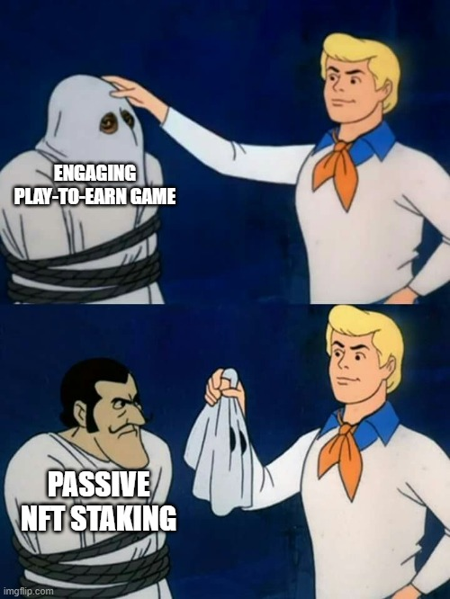

# web3-game
A trust-minimised implementation of a multiplayer online game on the blockchain.

## Motivation
Video games are supposed to be **fun** and **challenging**, not mindless, boring staking disguised as _"gameplay"_.

Here, I aim to design a _trust-minimized_ implementation that can support both single and multiplayer gameplay. It utilises the blockchain to build the player progression/rewards system and act as the game's decentralised, immutable database layer.

## Implementation