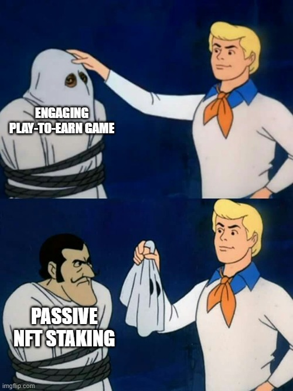
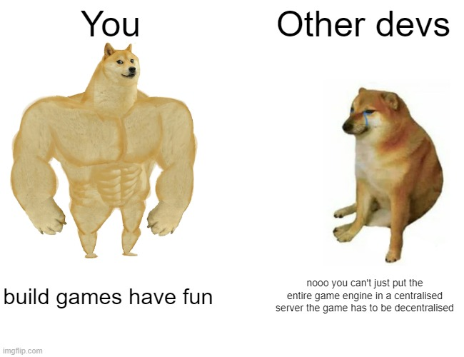

# web3-game
A trust-minimised implementation of a multiplayer online game on the blockchain.



## Motivation
Video games are supposed to be **fun** and **challenging**, not mindless, boring staking disguised as _"gameplay"_.

Here, I aim to design a _trust-minimized_ crypto game implementation that can support both single and live multiplayer gameplay. It utilises the blockchain to build the player progression/rewards system and act as the game's decentralised, immutable database layer.

## Running the example
Clone this repo and install dependencies
```
git clone https://github.com/hazelnutcloud/web3-game.git
cd web3-game
pnpm install
```
Start local node
```
pnpm run node
```
In another terminal, deploy smart contracts locally
```
pnpm run deploy
```
Start local multiplayer server
```
pnpm run server
```
In another terminal, start client
```
pnpm run client
```
## Stack
This implementation is targeted for the web and was built entirely using HTML and javascript (and solidity for smart contracts). However, it can be easily ported for mobile and desktop using [Capacitor](https://capacitorjs.com) and [Electron](https://electronjs.org). Here are the main frameworks used:
- [PhaserJS](https://phaser.io) - 2D Javascript game engine for client
- [Geckos.io](https://geckos.github.io) - Real-time client/server communication using WebRTC and NodeJS
- [Trustus](https://github.com/ZeframLou/trustus) - Trust-minimized way to access offchain data onchain

## Implementation

In this specific example, the goal is to collect the coin at the end of the room. However, this can be anything you want, e.g, collecting resources, beating a dungeon, or even defeating another player in PvP. Upon achieving the goal, the player will be able to call a smart contract and claim their rewards. Sounds simple enough? not really.

### Challenges and Solutions
How do you prevent players from cheating/hacking? Solution: we run the entire gameplay logic/engine on an authoritative server. This means that the client's role is to only send inputs to it. The server then processes those inputs through the game engine and sends back the client's updated state in return for the client to render. This guarantees the impossibility of cheating/hacking.


Running an authoritative server presents another challenge: latency. Processing everything on the server means deteriorated player experience as there will be some latency between the client and the server. Fortunately, [Geckos.io](https://geckos.github.io) provides a very neat package to solve our problem using something called snapshot interpolation. The author [Yannick](https://github.com/yandeu) explains it in an easy to understand video [here](https://www.youtube.com/watch?v=-9ix6JxpqGo)

Next, what's stopping the players to just call the smart contract and claim the rewards? This is where [Trustus](https://github.com/ZeframLou/trustus) comes in. Using an authoritative server enables us to control players' reward distribution based on trigger events. In this case, collecting the coin.

Once the server determines that the player has successfully collected the coin, an event will be triggered. During this event, the server will sign a message and send it to the player. The player can then use that message as input to call the game's smart contract. The smart contract can then verify that the message came from the server and process the payload to accordingly increase the player's progression on-chain or reward them with tokens/NFTs.

## Final thoughts



Although this approach may not seem to be the most trustless, decentralised solution to building crypto games since we rely on a centralised game server to handle the game engine, in my opinion, I think that's rarely an issue. Not everything needs to be on-chain. Having your players' progression and items stored there is more than enough. This even provides you an advantage in the form of flexibility, upgradability, control and most importantly, being able to build fun and engaging games for your players. Thank you for reading <3